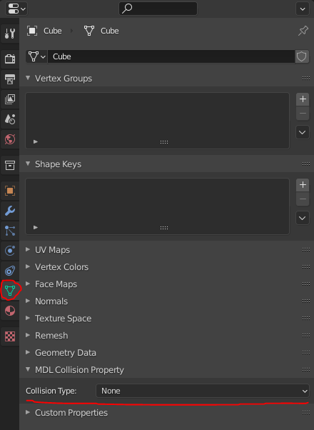
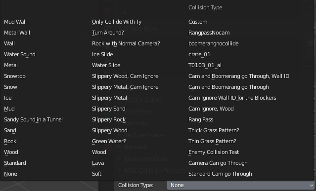

# Editing MDL Models

!!! warning "Animations"
    The plugin currently doesn't support importing/exporting `rigging`, or `editing animations`

## Installation
To edit the models you're gonna need blender and the MDL2 blender plugin created by Kana.
!!! info "Supported Blender Versions"
    The Plugin Only Supports Blender Versions 2.80 - 3.4.1

To get started:

- Download the most recent version from the releases tab [https://github.com/ElusiveFluffy/MDL2-Blender-Plugin/releases](https://github.com/ElusiveFluffy/MDL2-Blender-Plugin/releases){:target="_blank"}
- Open blender and go to `Edit>Preferences>Add-ons`, and click on the install button at the top right
- Navigate to the zip file downloaded from the releases tab and select it
- Now just enable the plugin to have the MDL import and export options

## Importing Models

To import models just import then like any other model format in blender in the `file>import>MDL2` option.

When importing models if there is a `"DDS" folder` in the same folder as the MDL file with the required .dds textures, the importer will automatically load in the textures and set up the textures in the materials for you.

When importing the textures the plugin will automatically detect if it should be transparent. But sometimes the alpha check is incorrect and will result in models that should be opaque to be set as alpha blend.

## Setting the Texture
When exporting the exporter uses the `first material slot's name` for the texture, as MDLs can only have 1 texture per mesh, and only support for a `diffuse` texture. 

Everything inside of the materials are **NOT** used when exporting, as the game doesn't support them and to simplify exporting. 

If you're adding a texture to be used by the exported model all you need is at least a empty material with its name as the texture's name (`excluding` the .dds part, which isn't needed in the name) or a name of one in global.mad. 

!!! info "Exporting"
    The plugin will not export the dds textures with the model when exporting. Its expected that they're already in or modded into the game

## Setting Collision Properties
Collisions are set through a custom collision panel, to easily select collision types (names taken from the comments in global.mad), with support for custom ones that you've added in the `global.mad` file.

!!! info "A couple things to note when setting a collision property"

    - If a collision property is set it will take priority over the texture name from the material when exporting. Because each mesh can only have either a texture name or collision property.
    - If a mesh has a collision property it will typically be rendered `invisible`. This can be changed in `global.mad` but not fully recommended.

The collision panel is located in the `object data properties` tab
 

## Ref Points

`Ref points` can be for multiple different purposes depending on the model. Like with the flying platforms the ref points relate to where the particles should be emitted.

If a model contains `ref points` they will be imported as empties in a ref points collection.

!!! info "Exporting"
    Its recommended to have the same amount of ref points, with the same names, as the original model that you're editing/replacing.